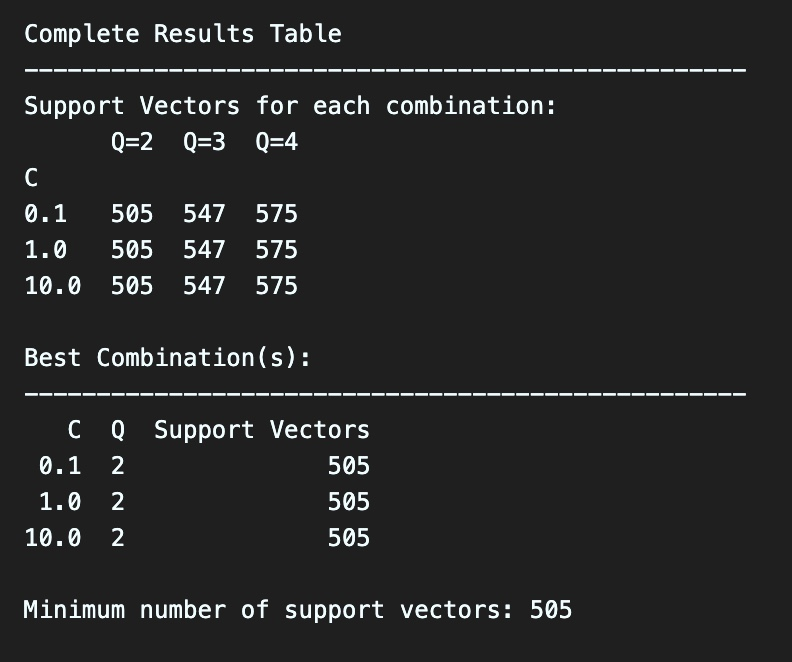

# 10. 
The result of the experiment is shown in the following figure:

From the figure, we can see that no matter how the value $C$ is set, the number of support vectors in always the same, and only differs when the value of $Q$ is changed.

If we recall what the parameter $C$ represents, it is the regularization parameter, which trades off the size of the margin and the total amount of the slack. 

This means that if we have a larger valuer of $C$, then we're giving the slack variables larger weights, meaning that our model will press more emphasis on minimizing the distance from the data points to its corresponding positve / negative margin hyperplane.

But as the result shows, the value of $C$ does not affect the number of support vectors, so this might due to the other parameter $Q$.

If we look at the parameter $Q$, it is the polynomial degree, so as $Q$ becomes larger, we project the data into a higher dimensional space, which makes the model more complex (having more intricate boundaries), thus intuitvely, the number of support vectors becomes larger. 

To conclude, I think that the polynomial of degree $2$ is already enough, so as we increase the value of $Q$, the classifier will just overfit, and this is also the reason why the value of $C$ does not affect the result, since if we can draw the boundary with a polynomial of degree $2$ with the least amount of support vectors, then it means that most of the data points will locate far from the decision boundary. (The degree-2 polynomial kernel already achieves a large margin with minimal misclassifications.)

