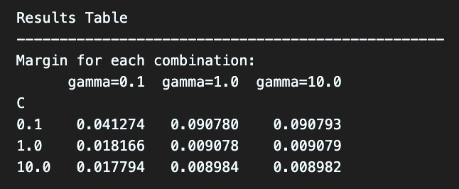
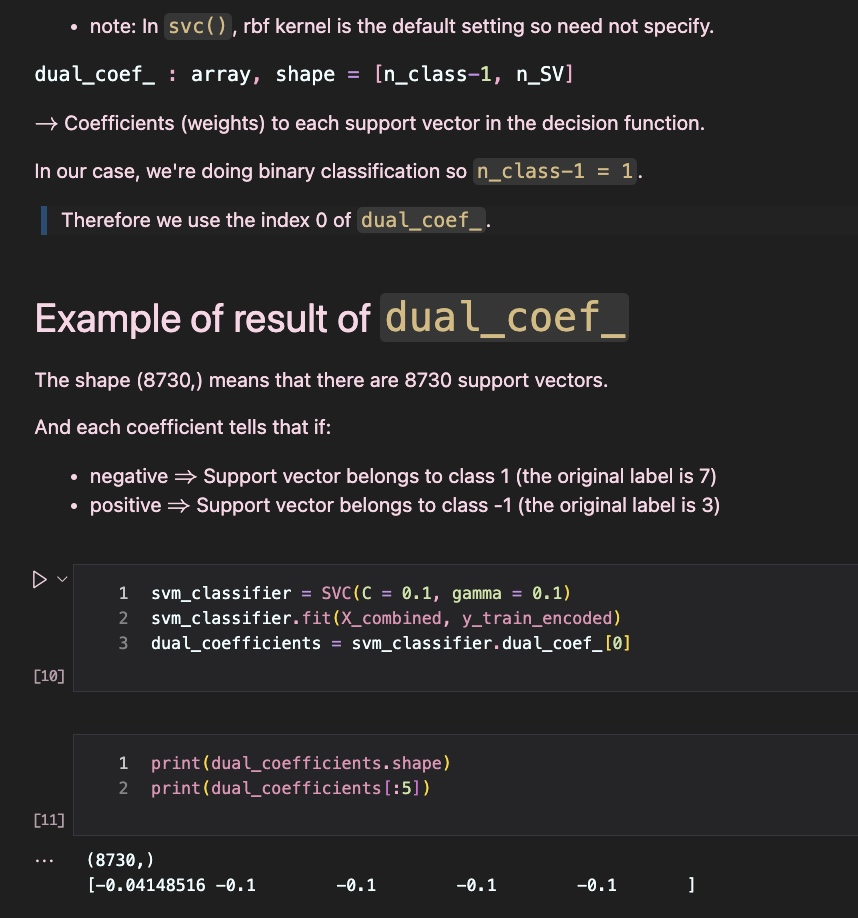
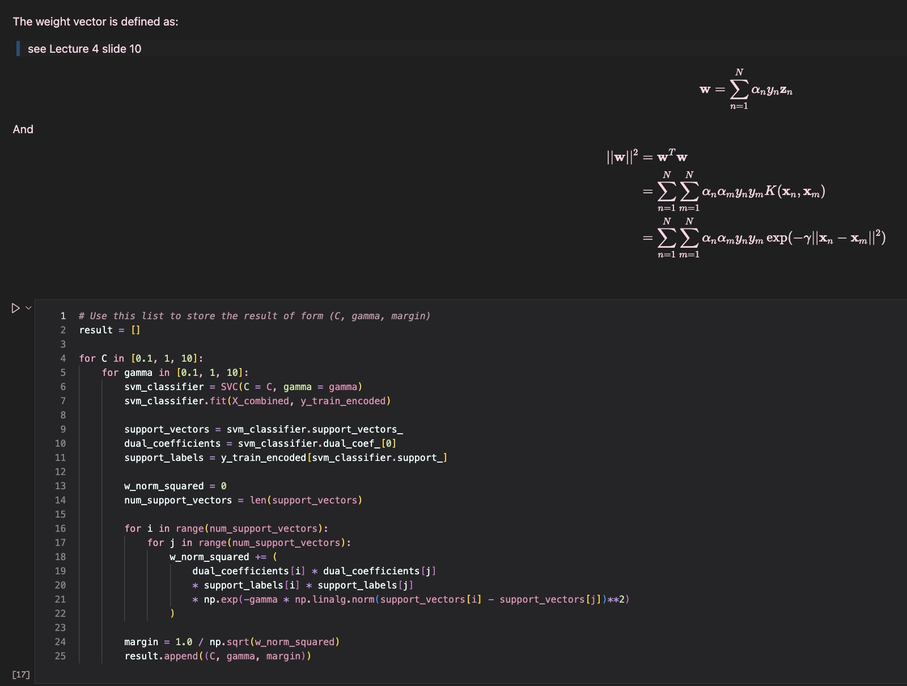

# 11. 

The result of the experiment is shown in the following figure:

## optimal parameter values

From the figure, we obtain that the largest margin is achieved when the value of $\gamma$ is $10$, and the value of $C$ is $0.1$.

## perspective from $C$

As explained in the previous question, the value of $C$ represents a trade-off between the margin and the training error. 

For example, when $C$ is large, to minimize the primal problem, we need to prioritize fitting the training data than minimizing the length of the weight vector, so that $||\mathbf{w}||$ may be larger, and the margin is smaller.

We can see this in our resulting table, for each given $\gamma$, when $C$ gets larger, the margin is smaller.

## perspective from $\gamma$

In this problem, we're asked to use the rbf kernel, which is defined as:

$$
K(x, x') = \mathrm{exp}(-\gamma ||x - x'||^2)
$$

The meaning of this kernel is that it measures the similarity between two points $x$ and $x'$ by considering the distance between them, and $\gamma$ controls the standard for how we consider two points to be similar.

For example, when $\gamma$ is large, the exponential function decreases rapidly as the distance between $x, x'$ becomes larger. This means that two points need to be very close to each other to be considered similar.

Why this will affect the decision boundary is because for a large $\gamma$, $\mathbf{K}(x, x')$ is very small even if $x$ and $x'$ are sligtly distant to each other, so the influence of a single training point will be limited to a small region around it. Therefore, the decision boundary will be influenced by only a few points around it, so the boundary is more intricate. 

On the other hand, when $\gamma$ is small, even for more distant points, they might also affect the decision boundary, so the boundary is smoother.

To conclude, a large $\gamma$ increases the complexity of the model, and results in a smaller margin, and this conclusion also matches our result.

## snapshot of code

The snapshots of my code are shown below:
> The beginning of the code is the same as the previous question, so I will only show the part after prepocessing (after relabeling).

