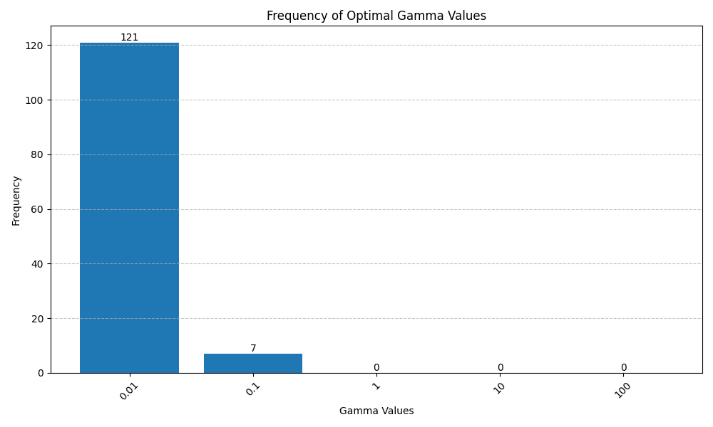
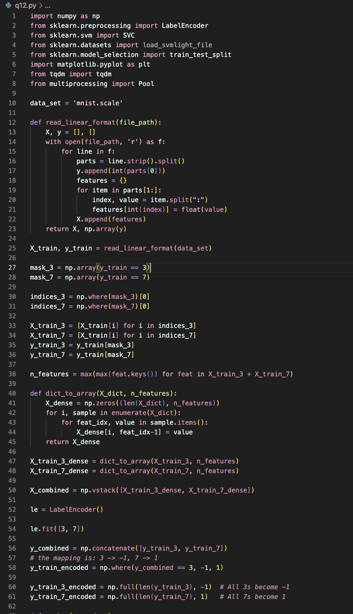
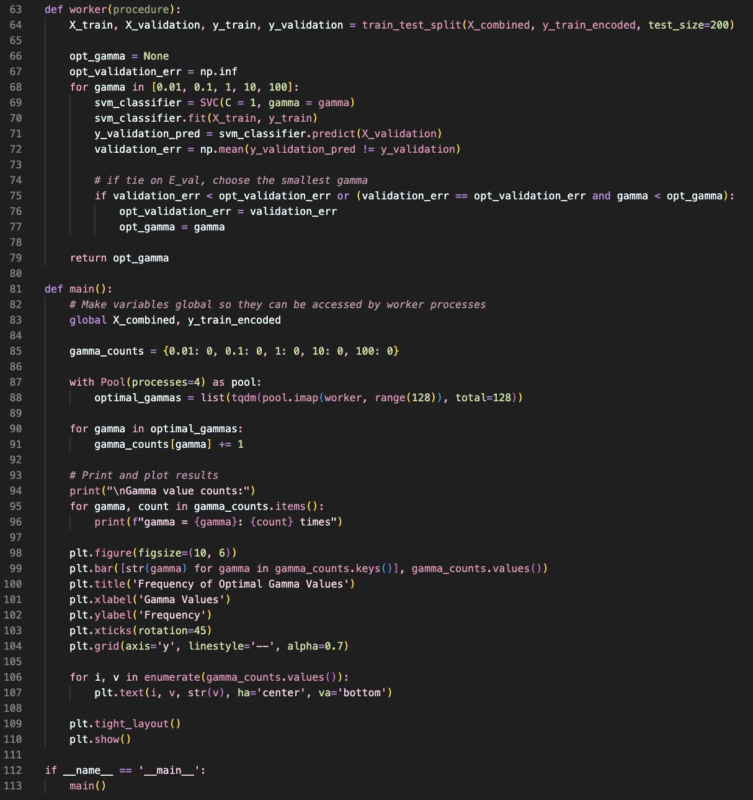

# 12.

The resulting bar chart of the number of times $\gamma$ is selected is as follows:

From this bar chart we can see that almost all of the optimal $\gamma$ values are $0.01$. 

As stated in the previous question 11, the value of $\gamma$ represents the standard, or the scale for how we consider two points to be similar.

## smallest $\gamma$ being optimal

The smallest $\gamma$ is optimal in most of the cases implies that the rbf kernel decays more slowly as the distance between two points grows bigger. This would make the decision boundary to be influenced by more points that are farther from it, thus making the decision boundary more smooth (indicating higher generalization ability).

As we take the validation error into consideration, this value evaluates how well the model generalizes, thus the smaller $\gamma$ is more likely to be optimal.

## a sligtly more complex model being optimal

But we still see that there's also some cases with $\gamma = 0.1$ being optimal, indicating that sometimes adding a little bit complexity to the model might be better.

This may due to the selection of our validation set, since we only select 200 points from the training set, this amount of examples might not be enough to represent the whole training set.

Furthermore, if the points in the validation set are near the decision boundary, the model with higher complexity might be able to better fit these points, even though it might not generalize well.

## why not the larger $\gamma$ values?

For $\gamma = 1, 10, 100$, these values are never selected to be optimal. 

Again from the meaning of $\gamma$, a larger $\gamma$ makes the decision boundary highly sensitive to the points that are really close to it, thus generating a intricate boundary.

As a result, complex boundaries cannot generalize well on the validation set, making the validation error high.

## code snapshot

